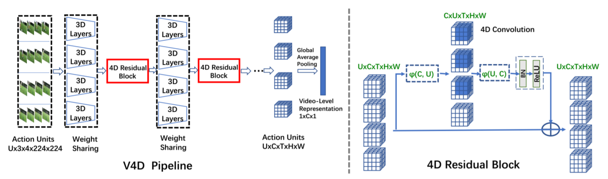

[](https://creativecommons.org/licenses/by-nc/4.0/)
# V4D: 4D Convolutional Neural Networks for Video-level Representation Learning

Code for the ICLR 2020 paper [V4D: 4D Convolutional Neural Networks for Video-level Representation Learning](https://arxiv.org/abs/2002.07442)

 

### Performance compared with SOTA methods on Kinetics

|Model | Backbone | Top1 | Top5 |
 |:---  |:--- |:-:|:-:|
|ARTNet with TSN | ARTNet ResNet18 | 70.7 | 89.3 |
|ECO| BN-Inception+3D ResNet18 | 70.0 | 89.4 |
|S3D-G| S3D Inception | 74.7 | **93.4**|
|Nonlocal Network | 3D ResNet50 | 76.5 | 92.6|
|SlowFast | SlowFast ResNet50 | 77.0| 92.6| 
|I3D|I3D Inception | 72.1 | 90.3|
|Two-stream I3D| I3D Inception | 75.7 | 92.0 |
|I3D-S |Slow pathway ResNet50 | 74.9 | 91.5 |
|Ours V4D | V4D ResNet50 | **77.4** |93.1|

### Requirements
- Python >=3.6
- PyTorch >=1.3
- [torchvision](https://github.com/pytorch/vision/) that matches the PyTorch installation.

### Train on Kinetics and Mini-kinetics

```bash
./scripts/train_kinetics.sh
./scripts/train_minikinetics.sh
```

### Test pretrained model on Mini-Kinetics-200 and Kinetics (download our trained model from [Google](https://drive.google.com/open?id=1J4kaRBb_sF9aPg60Xs9iYC6zYHKkR-MZ)) 

```bash
./scripts/test_kinetics.sh
./scripts/test_minikinetics.sh
```

### Contact

For any questions, please feel free to reach 
```
github@malongtech.com
```

If you use this method or this code in your research, please cite as:

    @inproceedings{zhang2020v4d,
    title={V4D: 4D Convolutional Neural Networks for Video-level Representation Learning},
    author={Zhang, Shiwen and Guo, Sheng and Huang, Weilin and Scott, Matthew R and Wang, Limin},
    booktitle={Proceedings of International Conference on Learning Representations},
    year={2020}
    }

## License

V4D is CC-BY-NC 4.0 licensed, as found in the [LICENSE](LICENSE) file. It is released for academic research / non-commercial use only. If you wish to use for commercial purposes, please contact sales@malongtech.com.
